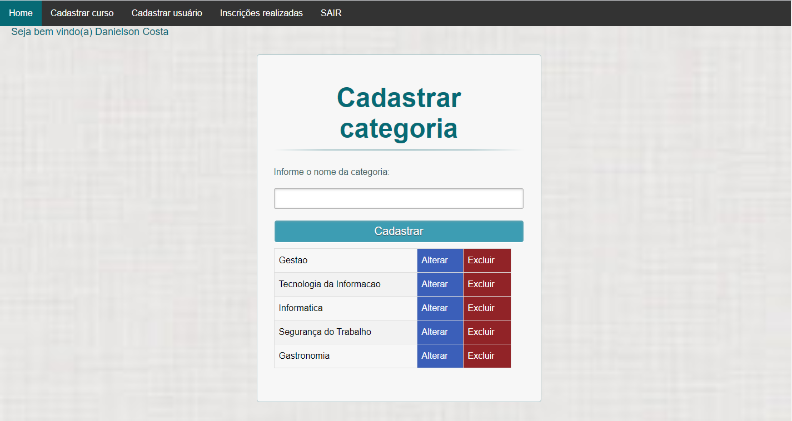

# ProjetoFinal - Curso PHP MYSQL - ESCOLA SENAC
- Ampliação das aulas básica de PHP com MYSQL ministrada pelo SENAC.
- O intuito do projeto foi fazer cada aluno colocar em prática tudo que foi passado em curso.
- Foi criado uma necessita de desenvolver um WEBSite para uma determinada empresa, no qual o website serviria para demostrar os cursos ofertados.
- E teriamos que levar em consideração que os cursos são divididos por categoria.
- E uma pré-inscrição deverá ser realizada demonstrando o curso de interesse para que a equipe da escola entre em contato com os possíveis alunos posteriormente.

#### Dois atores utilizarão o website.
+ Administrador
+ Usuário

## Administrador
#### Login:
- O usuário devera acessar a área de administração do site através de um formulário de login, essa área então será restrita a usuários cadastrados no sistema

#### Categoria:
- Será permitido através de uma interface php/html inserir, alterar e excluir categorias, além de mostrar as categorias já cadastradas.

#### Curso:
- Será permitido através de uma interface php/html inserir, alterar e excluir categorias, além de mostrar as categorias já cadastradas

#### Emitir relatório de Pré-inscrições:
- Emitir relatório de Pré-inscrições

## Usuário

#### Cadastrar Pré-inscrição:
- Permite navegar dentre os cursos disponíveis e ao demonstrar interesse por algum um formulário de pré-inscrição será apresentando para preenchimento

#### Buscar Curso:
- Permite informa uma chave de pesquisa e caso algum curso atende a essa condição deverá ser mostrado em tela.

## Veja como ficou o website
- Home:

